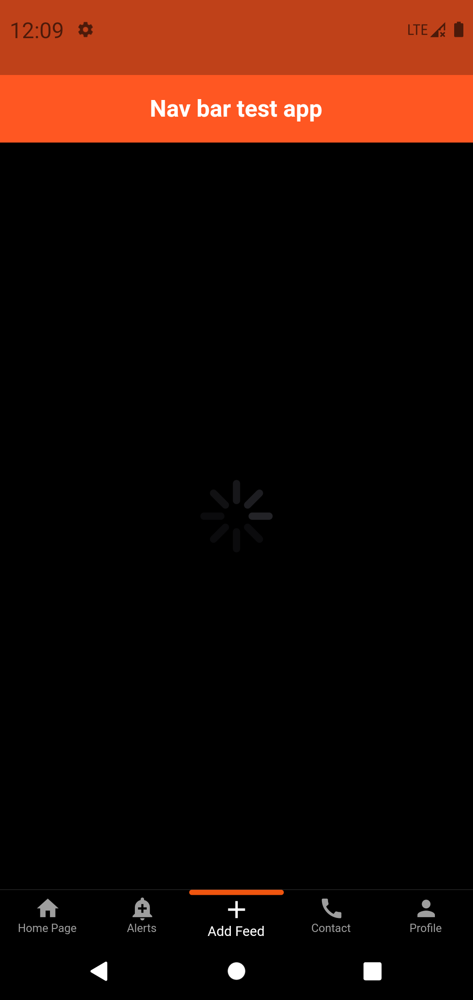

# responsive_navbar

This will help us to create responsive navigation bar.

Installing is so simply and it will work stable for any mobile platform.

```own_navbar: any```

## Getting Started



The minimalist code is here:


```
BottomNavbar(
        navItems: navItems,
        height: MediaQuery.of(context).size.height / 18,
        itemClicked: (int index, String navId) {
          print('Clicked index is $index \nClicked NavId is $navId');
        },
      )
```
Attribute's description: 
1. ```navItems```- List of  NavBarItem (```List<NavBarItem>```) that helps to create 3 different type of navigation bar (text+icon, icon and only text).
Example :
```final List<NavBarItem> navItems = [
    NavBarItem(
      elementIcon: Icons.home,
      elementName: "Home Page",
      navigationId: 'home',
    ),
    NavBarItem(
      elementIcon: Icons.add_alert,
      elementName: "Alerts",
      navigationId: 'alert',
    ),
    NavBarItem(
      elementIcon: Icons.add,
      elementName: "Add Feed",
      navigationId: 'feed',
    ),
    NavBarItem(
      elementIcon: Icons.call,
      elementName: "Contact",
      navigationId: 'contact',
    ),
    NavBarItem(
      elementIcon: Icons.person,
      elementName: "Profile",
      navigationId: 'profile',
    ),
  ];
  ```
2. ```height```- the height of bottom navigation bar. For better user experience just height is enough and library will automatically change icon size and font size due to this property.
Responsive height can be defined as ```MediaQuery.of(context).size.height / 18```.
3. ```itemClicked```- this function will called when one of navigation item clicked and it will return index of last clicked item with its ```navigationId```.
When user click one item more time frequently the state of navigation bar will not affected and the callback will not fired.
4. There are other plenty of properties of thees Widget. To discover the properties open ```pubspec.yaml``` file and add ```own_navbar: any```

